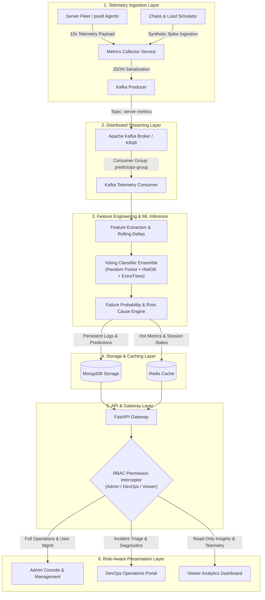

# PredictOps AI
### Real-Time Distributed Server Monitoring, Telemetry Streaming & Predictive Failure Maintenance

[](https://www.python.org/)
[](https://fastapi.tiangolo.com/)
[](https://scikit-learn.org/)
[](https://kafka.apache.org/)
[](https://www.mongodb.com/)
[](https://redis.io/)
[](https://www.docker.com/)
[](#role-based-access-control-rbac)
[](#testing--quality-assurance)
[](LICENSE)

---

## Table of Contents
- [Executive Summary](#executive-summary)
- [System Architecture](#system-architecture)
- [Machine Learning & Anomaly Detection Pipeline](#machine-learning--anomaly-detection-pipeline)
- [Role-Based Access Control (RBAC)](#role-based-access-control-rbac)
- [Key Features](#key-features)
- [Technology Stack](#technology-stack)
- [Repository Layout](#repository-layout)
- [REST API Reference](#rest-api-reference)
- [Testing & Quality Assurance](#testing--quality-assurance)
- [Engineering Team](#engineering-team)
- [License](#license)

---

## Executive Summary

**PredictOps AI** is an enterprise-grade infrastructure observability and predictive failure prevention platform. It ingests multi-metric server telemetry across distributed nodes, streams high-velocity events through **Apache Kafka**, computes behavioral variance features, and predicts server anomalies before infrastructure degradation leads to service downtime.

Built with a **Soft-Voting Ensemble Machine Learning Pipeline** (`RandomForest`, `HistGradientBoosting`, `ExtraTrees`), a reactive **FastAPI backend**, and a real-time **Chart.js operations dashboard**, PredictOps AI provides Site Reliability Engineers (SREs), DevOps Operators, and System Administrators with actionable root-cause diagnostics and automated alert triage.

---

## System Architecture

The following diagram represents the production data pipeline across ingestion, streaming, inference, persistence, and role-gated presentation layers:



---

## Machine Learning & Anomaly Detection Pipeline

PredictOps AI employs an ensemble classification strategy trained on high-frequency multidimensional server metrics.

| Pipeline Component | Specification | Technical Function |
| :--- | :--- | :--- |
| **Model Type** | `VotingClassifier` (Soft Voting) | Ensembles `RandomForestClassifier`, `HistGradientBoostingClassifier`, and `ExtraTreesClassifier`. |
| **Telemetry Features** | 12 Real-Time Variables | `cpu_usage`, `memory_usage`, `disk_usage`, `network_bytes_sent`, `network_bytes_recv`, `response_time_ms`, `error_rate`, `load_1m`, `load_5m`, `load_15m`, rolling variance, and delta metrics. |
| **Target Classes** | 3 Severity States | `0` (Normal / Healthy), `1` (Warning / Degraded), `2` (Critical Failure Imminent). |
| **Prediction Output** | Risk Probability & Attribution | Continuous risk score (0.0% to 100.0%), severity classification, and automated root-cause explanations. |
| **Model Storage** | Joblib Serialized Artifact | Packaged at `ML/models/anomaly_model.pkl` with runtime hot-reloading capability. |

---

## Role-Based Access Control (RBAC)

The platform enforces a granular 3-tier Role-Based Access Control model across backend API dependencies and frontend interfaces:

```
                               +-------------------------+
                               |   Authentication Layer  |
                               +------------+------------+
                                            |
               +----------------------------+----------------------------+
               |                            |                            |
               v                            v                            v
      +-----------------+          +-----------------+          +-----------------+
      |      ADMIN      |          |     DEVOPS      |          |     VIEWER      |
      | (Administrator) |          |   (Operator)    |          |    (Analyst)    |
      +--------+--------+          +--------+--------+          +--------+--------+
               |                            |                            |
   • User & Role Management     • Alert Acknowledge & Resolve • View Overview Dashboard
   • Model Retrain & Hot-Reload • Manual ML Diagnostics       • View Telemetry Trends
   • Chaos Simulator Controls   • Cache Invalidation          • View Failure Predictions
   • Alert Overrides & Audits   • Telemetry & Analytics Read  • View Active Alerts
```

### Permission Matrix

| Resource / Action | Viewer | DevOps Engineer | Admin | Backend Permission Key |
| :--- | :---: | :---: | :---: | :--- |
| **Landing Page & System Overview** | Read | Read | Read | `dashboard.read` |
| **Server Telemetry & Historical Trends** | Read | Read | Read | `telemetry.read` |
| **Chart.js Visualizations & Fleet Analytics** | Read | Read | Read | `analytics.read` |
| **AI Failure Predictions & Insights** | Read | Read | Read | `predictions.read` |
| **Active Anomaly Alerts** | Read | Read | Read | `alerts.read` |
| **Alert Acknowledgment & Resolution** | Denied | Granted | Granted | `alerts.acknowledge`, `alerts.resolve` |
| **Administrative Alert Override** | Denied | Denied | Granted | `alerts.override` |
| **On-Demand ML Diagnostic Triggers** | Denied | Granted | Granted | `ml.diagnostics` |
| **Model Retraining & Hot-Reloading** | Denied | Denied | Granted | `ml.retrain`, `ml.hot_reload` |
| **Cache Management & Telemetry Simulator** | Denied | Trigger Only | Full Control | `cache.flush`, `simulator.full_control` |
| **User Management (`/admin/users`)** | Denied | Denied | Full Control | `users.read`, `users.create`, `users.assign_role`, `users.deactivate` |

---

## Key Features

- **Automated Metric Sampling**: Collects CPU, memory, disk, network, error rates, and load averages on a 10-second polling cadence.
- **Dedicated Role Portals**: Independent login views for Admin, DevOps, and Viewer accounts with credential authorization checks.
- **Form Input Validation**: Alphanumeric username rules (only letters or mixed letters/numbers allowed; pure numeric usernames rejected) and RFC-compliant email verification during signup.
- **Real-Time Incident Triage**: Alert lifecycle management allowing operators to acknowledge, triage, resolve, or override anomalies.
- **Chaos & Stress Simulator**: Generates controlled memory leaks, CPU saturation, and latency spikes to test predictive thresholds.
- **Containerized Microservices**: Pre-configured Docker Compose environment for MongoDB, Kafka, Redis, and FastAPI.

---

## Technology Stack

| Layer | Technology | Purpose |
| :--- | :--- | :--- |
| **Backend Framework** | **FastAPI** / Python 3.10+ | Asynchronous REST API, WebSocket streams, and dependency injection |
| **Machine Learning** | **Scikit-Learn**, Pandas, NumPy | Ensemble classification, feature engineering, and model inference |
| **Message Streaming** | **Apache Kafka** (KRaft Mode) | Distributed pub/sub streaming of metric events |
| **Data Persistence** | **MongoDB Atlas / Community** | Historical telemetry storage, predictions, alerts, and audit logs |
| **In-Memory Cache** | **Redis 7** | Sub-millisecond metric caching and session state management |
| **Frontend UI** | **Vanilla JavaScript**, Chart.js, HTML5/CSS3 | Glassmorphism dashboard, real-time charts, and interactive controls |
| **Infrastructure** | **Docker** & **Docker Compose** | Multi-container orchestration and deployment packaging |
| **Test Automation** | **PyTest**, HTTPX TestClient | Automated integration, RBAC, and unit test verification |

---

## Repository Layout

```text
PredictOps-AI/
|-- Backend/                        # FastAPI Core Application
|   |-- config/                     # Database & cache connection management
|   |   |-- db.py                   # MongoDB client with auto-failover
|   |   `-- redis_client.py         # Redis connection client
|   |-- routes/                     # Modular API route controllers
|   |   |-- auth_routes.py          # Authentication, token issuing & /auth/me
|   |   |-- alert_routes.py         # Alert triage with RBAC permissions
|   |   |-- metrics_routes.py       # Live & historical metrics endpoints
|   |   |-- prediction_routes.py    # Failure prediction triggers & history
|   |   |-- rbac_routes.py          # User management (/admin/users) & roles
|   |   `-- admin_routes.py         # Chaos simulator & cache flush controls
|   |-- services/                   # Business logic and streaming services
|   |   |-- kafka_consumer.py       # Kafka consumer & real-time inference loop
|   |   |-- prediction_service.py   # Model loading and ensemble prediction
|   |   |-- feature_engineering.py  # Telemetry preprocessing and feature scaling
|   |   |-- rbac_service.py         # RBAC permission matrix and user store
|   |   |-- chaos_service.py        # Chaos testing and synthetic load generator
|   |   `-- cache_service.py        # Redis caching layer for fast dashboard reads
|   |-- static/                     # Frontend UI assets
|   |   |-- css/                    # Glassmorphism stylesheets
|   |   `-- js/                     # Real-time WebSocket clients, Chart.js managers
|   |-- templates/                  # Server-rendered HTML templates
|   |   |-- landing.html            # Public landing page with fleet health stats
|   |   |-- login.html              # Dedicated 3-Role login portals (Admin/DevOps/Viewer)
|   |   |-- dashboard.html          # Main live monitoring dashboard
|   |   |-- alerts.html             # Role-gated incident triage workspace
|   |   |-- analytics.html          # Historical charts and utilization distributions
|   |   |-- predictions.html        # ML failure probability rankings & root causes
|   |   |-- admin.html              # Admin operations & Chaos simulator console
|   |   `-- admin_users.html        # Admin user and role management console
|   `-- main.py                     # Application entrypoint & middleware configuration
|-- collector/                      # Server telemetry collection service
|   |-- metrics_collector.py        # 10s psutil metric sampler & Kafka producer
|   `-- kafka_producer.py           # Kafka publisher helper
|-- ML/                             # Machine learning models & training scripts
|   `-- models/
|       |-- anomaly_model.pkl       # Serialized ensemble Voting Classifier
|       |-- train_model.py          # Model training pipeline
|       |-- evaluate_model.py       # Cross-validation & performance evaluation
|       `-- predict.py              # CLI prediction testing script
|-- preprocessing/                  # Data transformation and validation tools
|   |-- preprocess_data.py          # Data cleaning and feature normalization
|   `-- Feature engineering.py      # Feature extraction utilities
|-- docker-compose.yaml             # Multi-service container orchestration
|-- Dockerfile                      # Production container build specification
|-- requirements.txt                # Python package dependencies
|-- .env.example                    # Sample environment variables
`-- README.md                       # Project documentation
```

---

## REST API Reference

FastAPI auto-generates interactive API documentation accessible at:
- **Interactive Swagger UI**: `http://localhost:8000/docs`
- **ReDoc Documentation**: `http://localhost:8000/redoc`

### Key Endpoints

#### Authentication & Authorization
| Method | Endpoint | Description | Access Level |
| :--- | :--- | :--- | :--- |
| `POST` | `/auth/login` | Authenticate user credentials with role verification | Public |
| `POST` | `/auth/register` | Register new account with email & username validation | Public |
| `GET` | `/auth/me` | Retrieve authenticated profile, assigned role, and permissions | Authenticated |
| `POST` | `/auth/logout` | Terminate session and clear authentication cookies | Authenticated |

#### Telemetry & Server Fleet
| Method | Endpoint | Description | Required Permission |
| :--- | :--- | :--- | :--- |
| `GET` | `/api/metrics/latest` | Ingest latest server telemetry snapshot | `telemetry.read` |
| `GET` | `/api/metrics/history` | Historical time-series telemetry series | `telemetry.read` |
| `GET` | `/api/servers` | Enumerate registered fleet servers and statuses | `dashboard.read` |

#### Machine Learning & Predictions
| Method | Endpoint | Description | Required Permission |
| :--- | :--- | :--- | :--- |
| `GET` | `/api/predict/all` | Fetch latest failure predictions and risk scores | `predictions.read` |
| `POST` | `/api/ml/diagnostics` | Trigger on-demand ML diagnostic scan across fleet | `ml.diagnostics` |
| `POST` | `/api/ml/retrain` | Initiate model retraining pipeline and hot-reload | `ml.retrain` |

#### Alert Triage & Operations
| Method | Endpoint | Description | Required Permission |
| :--- | :--- | :--- | :--- |
| `GET` | `/api/alerts` | List active anomaly alerts with severity categorization | `alerts.read` |
| `POST` | `/api/alerts/{id}/ack` | Acknowledge active incident | `alerts.acknowledge` |
| `POST` | `/api/alerts/{id}/resolve` | Mark incident as resolved | `alerts.resolve` |
| `POST` | `/api/alerts/{id}/override` | Administrative override and incident suppression | `alerts.override` |

#### Admin Operations & Chaos Controls
| Method | Endpoint | Description | Required Permission |
| :--- | :--- | :--- | :--- |
| `GET` | `/api/admin/users` | List registered user accounts and roles | `users.read` |
| `PUT` | `/api/admin/users/{id}/role` | Assign updated role to user | `users.assign_role` |
| `POST` | `/api/admin/chaos/inject` | Inject simulated stress into telemetry stream | `simulator.full_control` |
| `POST` | `/api/admin/cache/flush` | Invalidate Redis hot cache | `cache.flush` |

---

## Testing & Quality Assurance

PredictOps AI includes an automated test suite validating RBAC enforcement, role login authentication, input validation rules, and API response structures.

Execute tests via `pytest`:

```bash
pytest scratch/test_role_portals_login.py scratch/test_rbac_matrix_complete.py scratch/test_user_validation_and_fleet_icon.py -v
```

### Test Coverage Highlights
- Role-Based Access Control matrix enforcement across Admin, DevOps, and Viewer.
- Dedicated role portal login routing and token claims.
- Username and email format verification.
- HTTP 401 Unauthorized and HTTP 403 Forbidden rejection paths.
- Machine Learning feature alignment and prediction stability.

---

## Engineering Team

- **Vamsi Krishna** – *Lead Architect & Backend/ML Engineer*
  - Email: `vvamsikrishnakoneit@gmail.com`
  - GitHub: [@vvams](https://github.com/kondredigeethanjali18-cyber)

- **Geethanjali Kondredi** – *Lead Data Engineer & Frontend Architect*
  - Email: `kondredigeethanjali18@gmail.com`
  - GitHub: [@kondredigeethanjali18-cyber](https://github.com/kondredigeethanjali18-cyber)

---

## License

This project is licensed under the **MIT License**. See the [LICENSE](LICENSE) file for complete details.
